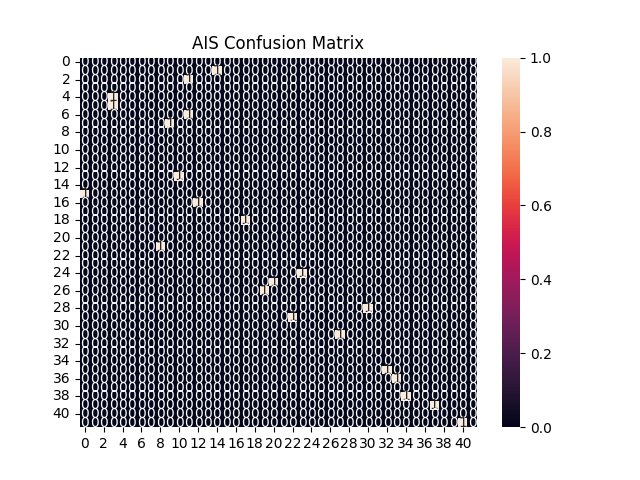

# 🏥 Predictive Healthcare Model using Evolutionary Algorithms

## 👨‍💻 Author

**Sagnik Patra**

---

## 📌 Project Overview

This project focuses on building a **Predictive Healthcare Model** using advanced **Machine Learning** and **Evolutionary Optimization Algorithms**.

The system automatically:

* Cleans and preprocesses healthcare data
* Detects whether the problem is **classification or regression**
* Applies **feature selection using evolutionary algorithms**
* Trains a model for prediction
* Generates **graphs, metrics, and result files**

---

## 🚀 Features

* ✅ Automatic data preprocessing (handling missing values, encoding)
* ✅ Intelligent task detection (Classification / Regression)
* ✅ Feature selection using:

  * Genetic Algorithm (GA)
  * Particle Swarm Optimization (PSO)
  * Quantum PSO (QPSO)
  * Harmony Search Algorithm (HSA)
  * Grey Wolf Optimization (GWO)
  * Whale Optimization Algorithm (WOA)
  * Ant Lion Optimization Algorithm (ALOA)
  * Bat Algorithm (BA)
* ✅ Model training using Random Forest
* ✅ Graph generation and saving
* ✅ CSV export of results and predictions

---

## 📂 Dataset

**File Used:**

```
PCA0000_2011_MDDS.xls
```

**Location:**

```
C:\Users\NXTWAVE\Downloads\Predictive Healthcare Model\
```

---

## ⚙️ Installation

### 1️⃣ Install Dependencies

```bash
pip install pandas numpy matplotlib seaborn scikit-learn openpyxl
```

---

## ▶️ How to Run

1. Place the dataset in the specified folder
2. Run the Python script:

```bash
python main.py
```

---

## 📊 Output Files

All results are saved in:

```
C:\Users\NXTWAVE\Downloads\Predictive Healthcare Model\
```

### 📈 Generated Outputs

* Accuracy Graph
* Heatmap
* Confusion Matrix
* Results CSV
* Predictions CSV
* Prediction Graph

---

## 🖼️ Visualization Example

### 📊 Confusion Matrix



---

## 📊 Sample Outputs

### 📈 Accuracy Graph

* Shows optimization progress over iterations

### 🔥 Heatmap

* Displays feature correlation

### 📊 Confusion Matrix

* Shows classification performance

### 📄 CSV Outputs

* `results.csv` → Final metrics
* `predictions.csv` → Actual vs Predicted values

---

## 🧠 Algorithms Used

| Algorithm | Purpose                        |
| --------- | ------------------------------ |
| GA        | Evolutionary feature selection |
| PSO       | Swarm-based optimization       |
| QPSO      | Quantum-based PSO              |
| HSA       | Harmony-based search           |
| GWO       | Grey wolf hunting strategy     |
| WOA       | Whale bubble-net hunting       |
| ALOA      | Ant-lion interaction           |
| BA        | Bat echolocation               |

---

## 📈 Model Used

* **Random Forest**

  * Works for both classification & regression
  * Robust and accurate

---

## ⚠️ Notes

* The last column in the dataset is treated as the **target variable**
* If target has many unique values → regression is used
* Otherwise → classification is used

---

## 🔮 Future Improvements

* Add XGBoost / Deep Learning
* Hyperparameter tuning
* Web dashboard (Streamlit)
* Real-time healthcare prediction system

---

## 📜 License

This project is for **academic and research purposes only**.

---

## 🙌 Acknowledgment

Thanks to open-source libraries and research in **evolutionary computation** and **machine learning**.

---

## ⭐ If you like this project

Give it a ⭐ on GitHub and share!

---
